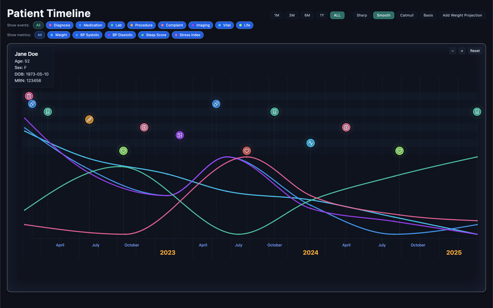
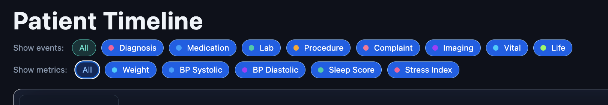
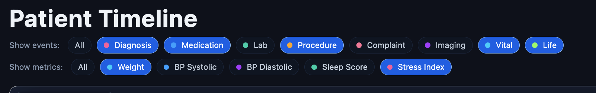
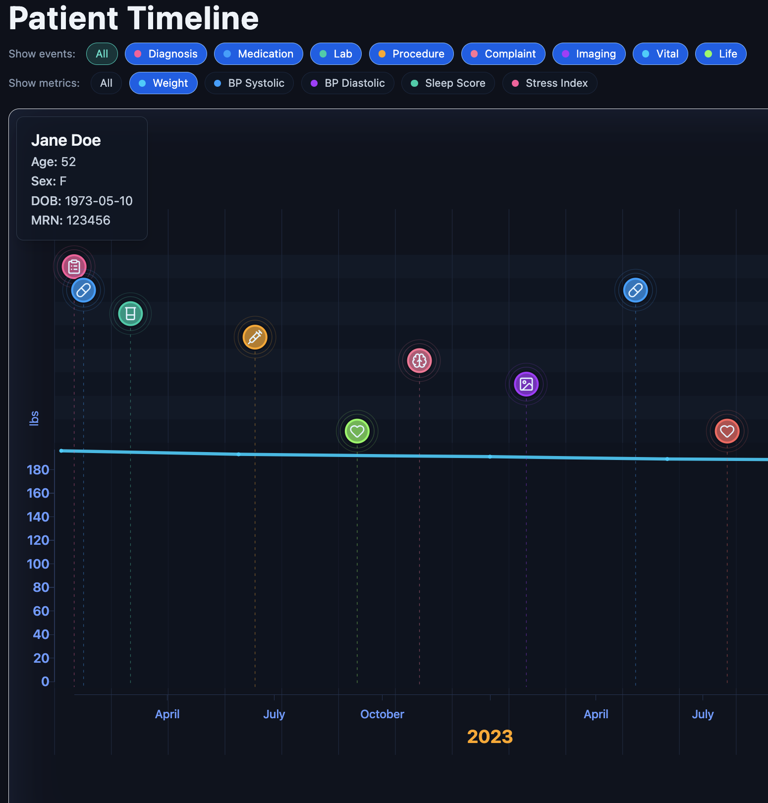
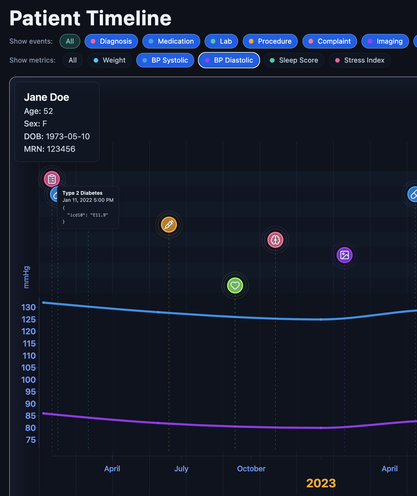
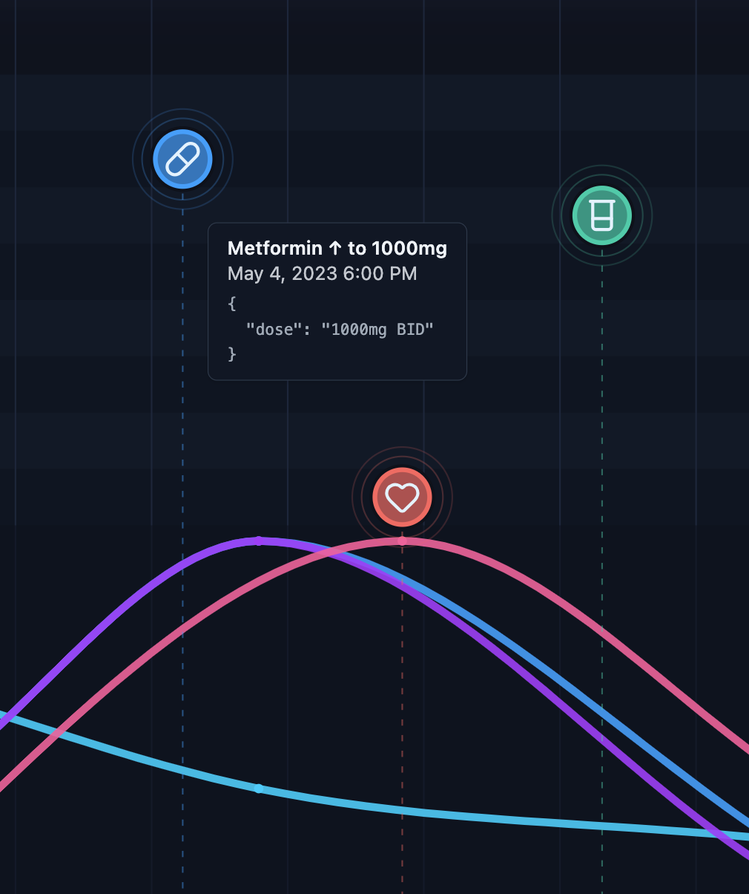
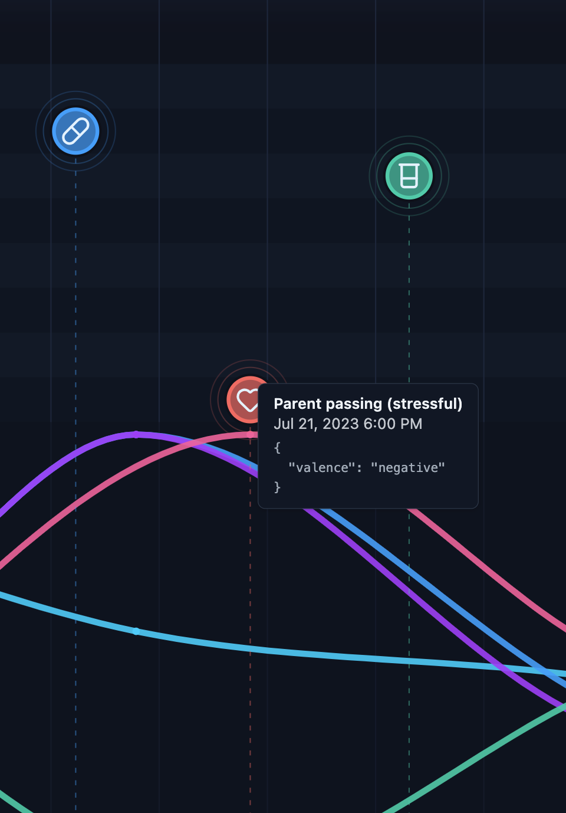
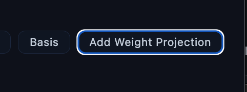
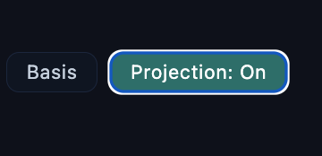
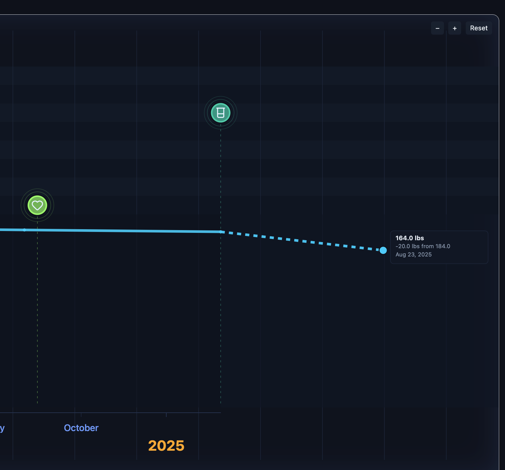

# synoptic-timeline
A next-generation, responsive, patient timeline that allows a physician to get a quick overview of a patients health journey over time.

# Overview
This is an overview of the Patient Timeline feature v1. The chart is highly interactable with intuitive user interactions that support panning, zooming, and scrolling.

# Features

## Filterable Events and Metrics
A user (physician/practicioner) can use the filter feature at the top of the graph to filter on key events and metrics for a nice visual experience and to dig deeper.
  

Before - with all selections

  

After - on key selections

With the filter active, only selected Events and Metrics appear in the timeline. Metrics with common axis units display units (like Systolic/Diastolic blood pressure). Metrics with uncommon axis units are normalized (this could be an area of improvement).

### Weight
Note that when a single Metric is selected, the y-axis displays the details of the metric including a range and units

  

### Blood Pressure
Metrics with shared units that are selected display those units on the y-axis. In this example, blood pressure.

  

### Events
Detailed information about Events can be obtained by hovering over the event itself in the graph.

Additionally, we will ultimatley want to be able to correlate changes in key metrics with events. For example, positive and negative psychological life events may affect users stress levels or sleep score. These events will be qualified. Starting and stopping medications may alter key metrics.

## Future Projections
Future projections extends the chart area and allows a user to "project" what a future health state might look like (an example could be losing 10 lbs).
  
Toggle the Projections button:
  

The timeline chart area expands and allows the user to set the metric state for a given date (a weight change by a given date)

We maintain detailed patient data that allows us to leverage precision medicine expertise, genetic information, and AI to create an optimal path to achieve the state through work with the clinician as well as lifestyle factors.

Over time, we can accurately model many future outcomes as our data becomes more comprehensive.

